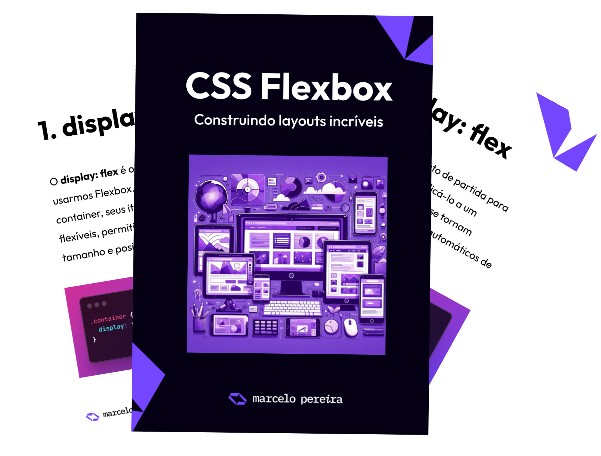

    

---

# Projeto EBOOK Gerado por I.A.s

> ℹ️ **NOTE:** Este repositório foi criado para o desafio "Criando um Ebook com ChatGPT & MidJourney" durante o "Santander Bootcamp 2024 - Trilha: Fundamentos de IA para Devs" da [DIO](https://dio.me).

Neste desafio utilizei algumas ferramentas de IA para criar um eBook sobre "CSS Flexbox". Para isso criei alguns "prompts" para gerar o título, conteúdo e imagens para o Ebook.

<a href="https://github.com/marcelopoars/prompts-recipe-to-create-a-ebook/blob/main/output/ebook-css-flexbox-por-marcelo-pereira.pdf" title="Clique para ler o pdf"> 📕Clique aqui para ler o eBook</a>

## 💻 Tecnologias utilizadas no projeto

- [ChatGPT](https://chat.openai.com/)
- [MidJourney](https://www.midjourney.com/app/)
- [Designer Microsoft Image Creator](https://designer.microsoft.com/image-creator)
- [Google Presentation](https://docs.google.com/presentation)

## 🧠 Prompts

Abraixo estão todos os prompts criados para o desafio.

ChatGPT：

| Ação              | prompt                                                                                                                                                                                                                                                                                                                               |
| ----------------- | ------------------------------------------------------------------------------------------------------------------------------------------------------------------------------------------------------------------------------------------------------------------------------------------------------------------------------------ |
| Título   | Crie um titulo para um e-book sobre o tema "CSS Flexbox". Este e-book é do nicho de programação e o subnicho é CSS. O título deve ser curto e épico e tenha uma temática mais nerd. O publico alvo desde e-book são jovens pessoas iniciantes em programação e pessoas interessadas por HTML e CSS. Me liste 5 variações de títulos. |
| Conteúdo | Crie um texto para ebook sobre "CSS Felxbox", explicando de forma simples seus principais seletores. Explique sempre de maneira simples. Escreva um texto enxuto e resumido. Sempre traga exemplos em pequenos trechos de código. Crie um título para cada tópico.                                                                   |
|                   |

Midjourney：

|            Ação             | prompt                                                                                                                                                    |
| :-------------------------: | --------------------------------------------------------------------------------------------------------------------------------------------------------- |
| Ilustração | Create an illustration with devices used to browse the web, such as desktops, tablets and cell phones, with screens of different sizes. Use purple tones. |
|                             |

## ✨ Features

- Conteúdo gerado via ChatGPT
- Imagens geradas via MidJourney

## 📚 Materiais

- Imagens utilizadas em `assets`
- ebook gerado durante as aulas em `output`

## 🛠️ Instruções de execução

Utilize os prompts acima nas ferramentas sugeridas para gerar o material base e utilize uma ferramenta de edição de documentos como power point, libreoffice , indesign para diagramação.

## 👨‍💻 Expert

    
    <strong>Marcelo Pereira</strong>
     
    <a href="https://github.com/marcelopoars" target="_blank">
        GitHub
    </a>
    &nbsp;|&nbsp;
    <a href="https://linkedin.com/in/marcelopoars" target="_blank">LinkedIn</a>
    &nbsp;|&nbsp;
    <a href="https://instagram.com/dicadonerd" target="_blank">
        Instagram
    </a>
    &nbsp;|&nbsp;

 

---

Criado com 💜 por [Marcelo Pereira](https://github.com/marcelopoars)
